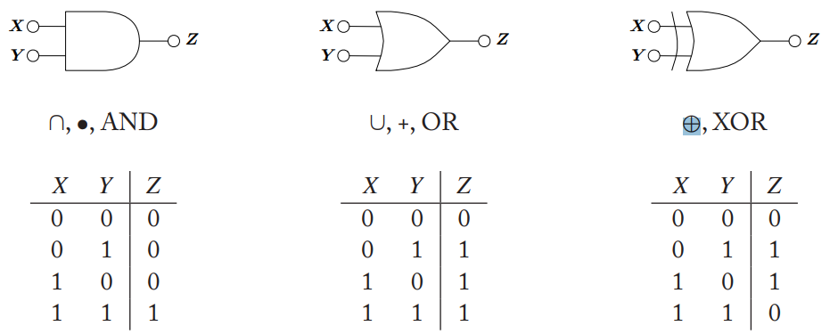
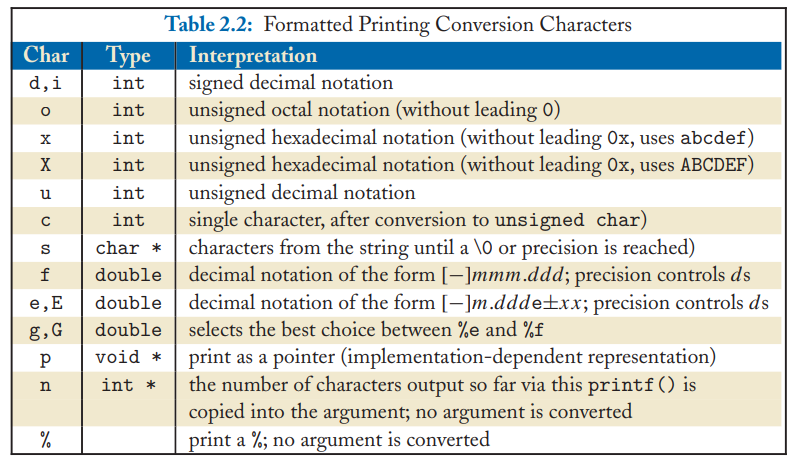
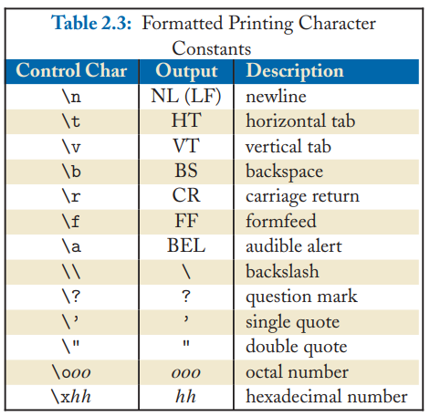
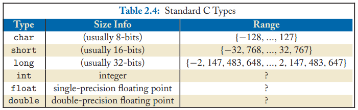
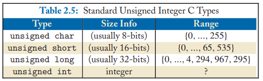

### Digital Logic Fundatmentals

### Big-Endian vs Little-Endian
Suppose you are given {N}2 = (00100110) but not told the order. The meaning of the bit string could be either Nbig-endian = 32 or Nlittle-endian = 100.

### Representing negative values in Binary
**Two's Complement**: Let n = 8. The representation for 77 is (01001101), just like in all other cases. To get -77 in the two’s complement code, we negate the number, which means we invert all the bits and add 1, so (10110011).

## ANSI C
- If we write software using only ANSI C, then it will build to run on any target platform with ANSI C compiler.
- Every microprocessor has its own unique set of machine instructions

Goals of a software project should be to place as much code into the Application Layer as possible to reduce the amount of effort necessary for porting code to other platforms.

### Conversation Characters and Interpretations

### Formatted Printing Character Constants

### Standart and Unsigned Integer C Types

