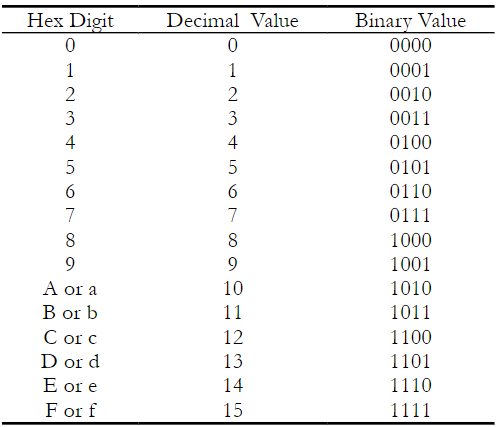
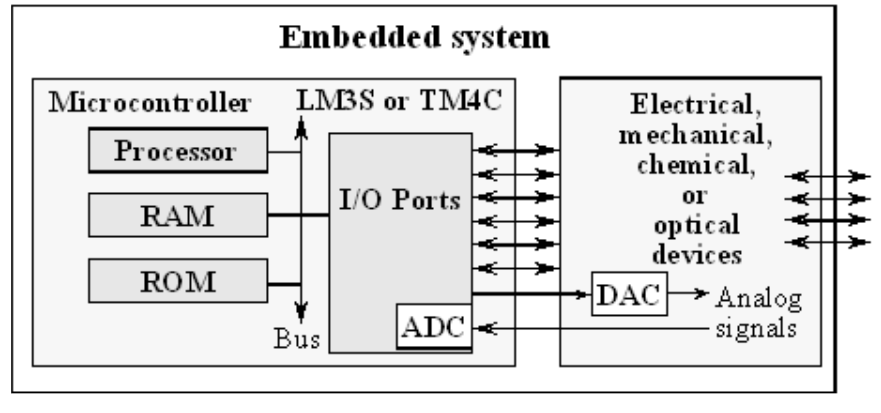
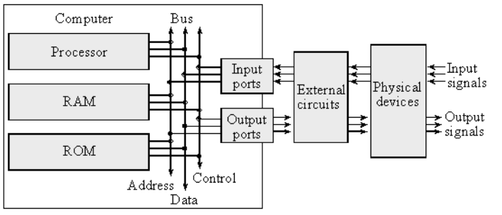

# C1 - Intro
> https://users.ece.utexas.edu/~valvano/Volume1/E-Book/C1_EmbeddedSystemsShapeTheWorld.htm
ADC and DAC are the methods to bridge computers with electronics.
Electrical eng. concepts include Ohms Law, LED voltage/current, resistance measurement and motor control.
Computer engineering concepts include I/O device drivers, debugging, stacks, FIFO queues, local variables and interrupts.
The hardware construction is performed on breadboards and debugging using a multimeter (measuring voltage).
SW developed in C, always first simulation then run on microcontroller. 
SW debugging occurs during simulation. Verification occurs in both stages.

# C2 - Fundamental Concepts

## 2.0 Intro

Embedded system is a system that performs specific task and has a computer embedded inside.
Why embedded systems are evolving, growing and getting more complexier: 
- needs for increased number of line
- faster calculation  per sec. requirements
- system verification for safety critical applications
Therefore systems nowadays should employ, parallel programming, high-speed synch, RTOS, fault tolerant design, priority interrupt handling and networking.

## 2.1 Binary Number Systems
Example of decimal number system:
- 273.15 = 2•10^2 + 7•10^1 + 3•10^0 + 1•10^-1 + 5•10^-2

Microcontrollers can operate in binary numbers in 8, 16, 32 bits. 8 bit is a byte.
For humans, things are simplified and used ***hexadecimal*** which use base 16 and its values is selected from the set {0, 1, 2, 3, 4, 5, 6, 7, 8, 9, A, B, C, D, E, F}
To express hex, we put ***0x*** or ***$*** before the number to mean hex.
A **"nibble"** is defined as 4 binary bits or one hexadecimal digit or half of byte. Each nibble below assigned to one hex digit.

Example:
- 0x12AD = 1*16^3 + 2*16^2 + 10*16^1 13*16^0

8 bit DAC can generate 256 different analog outputs.
8 bit ADC can generate 256 different digital outputs.

A byte contains 8 bits where each bit b7,...,b0 is binary and has the value 1 or 0. We specify b7 as the most significant bit or MSB, and b0 as the least significant bit or LSB.

## 2.2 Embedded System : Embedded Mcrocomputer System
In embedded systems
- ROM : for storing SW and fixed constant data
- RAM : for temporary info 
- Flash EEPROM : Electrically erasable programmable is used in Embedded microcomputers

Example: SW of the digital watch is stored in ROM (nonvolatile), that's why watch behaves like watch after re-inserting its battery.

>> Microcontoller  == Single chip computer by incorporating processor, RAM, ROM I/O ports into a single package to perform specific tasks (Ardunio)

>> Microcomputer == Small- complete computer that includes a processor, memory and I/O devices. (RasPi)

>> Microprocessor -- only a single processor (Intel, AMD)

>> I/O devices ==  parellel ports, serial ports, timers, DAC, ADC,     

>> Interface == allows computer to communicate with external hardware

**Classification of I/O Interfaces**
- Parallel interface: multiple data lines allowing for simultanaeously transmission of multiple bits of data.
- Serial interface: data is transmitted one bit at a time over a single data line. Simplier, slower, cheaper, more scalable.
- Analog interfaces: Transmit continious data, typically seen in a systems that interact with physical world (sensors and actuators, temparatur)
- Time-encoded interface: rely on timind of signals instead of binary representation.

*** Embedded System Schema1 ***
 

**Drive Driver**
A set of software functions facilitates I/O interface. Ports are collection of pins, usually 8, which can be either input/output.
If input: SW gets 8 bits (boolean) representing high or low
If output: SW writes

**Real-Time**
Upper bound on the time to perform the "input-calculation-output" sequence. This response time interface called ***latency***.

**Execution of Periodic Tasks**
A periodic task must be performed at equal-time intervals.

**SW Maintanence**
Includes: Validation, adding feature, updates, fixing bugs
Simulation is also important as we rate to build better machines with shorter design cycles.
The effective approach to build an embedded systen is to design using a hardware/sw simulator and download and test the system on actual microcontroller

### 2.3 Introduction to Computers*
Computer combines : Processor, RAM, ROM, I/O ports.

Neumann Achitecture

Port: is a physical connection between computer and outside world
Microcontroller: contains all the components of computer in a single chip.
RAM store information by writing to it, or it can retrieve previously stored data by reading from it. RAMs are volatile; meaning if power is interrupted and restored the information in the RAM is lost.

### 2.4 I/O Ports
External devices attached to MCU for functionality.
A pin is a wire on MCU for i/o.
A port is a collection of pins.
A Interface is collection of I/O port, external electronics, pysical device and SW which allow computer to communicate world.
Example input interface : Switch for toggling / output : LED 

I/O interfaces categorized into 4:
- Parallel : binary data avaliable simultaneously on a group of lines 
- Serial : binary data avaliable one bit at a time on a single line
- Analog: 
- Time: 